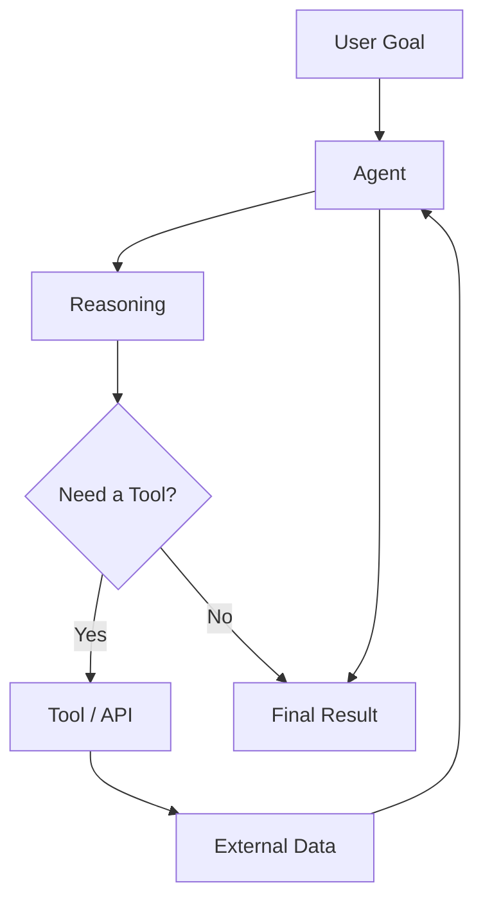
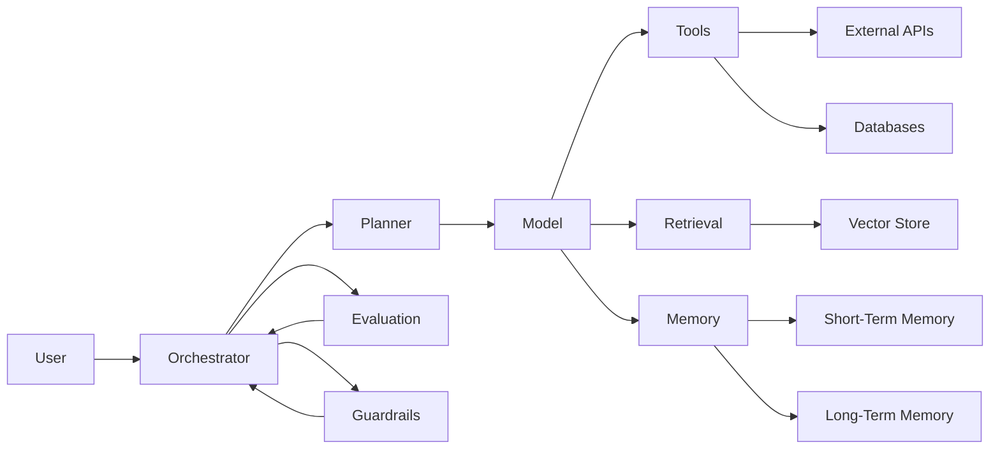
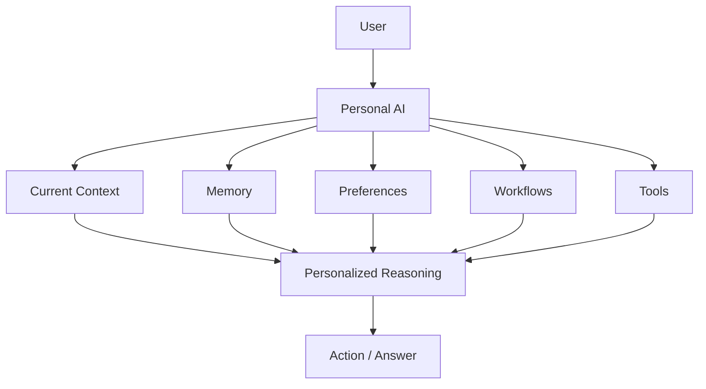
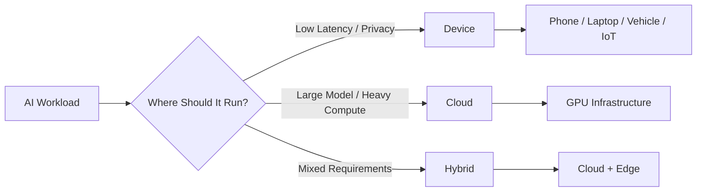
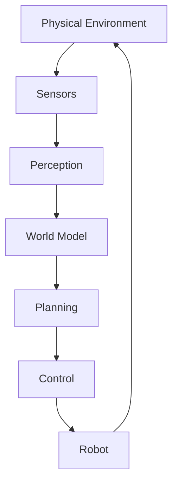
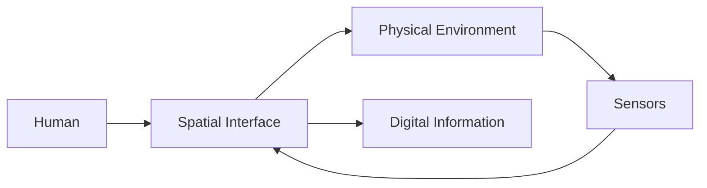
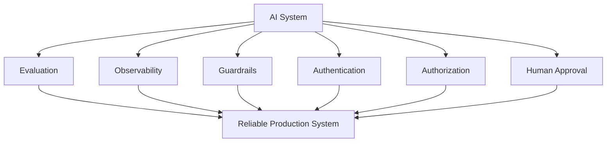
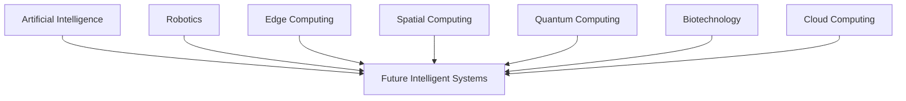

# The Future of Technology: When Software Starts to Think and Act

Technology has always been about extending what humans can do.

The first computers helped us perform calculations faster. Programming languages made machines easier to control. The internet connected people and information. Smartphones put computing into our pockets.

Now, something fundamentally different is happening.

Software is beginning to move from systems that **wait for instructions** toward systems that can **understand goals, reason about problems, use tools, and take action**.

That shift could define the next generation of technology.

> **The future of technology may not be about building better tools. It may be about building systems that can understand what we want to accomplish and help accomplish it.**

## Key Takeaways

* Technology is moving from command-driven software toward intent-driven systems.
* Agentic AI extends generative AI with planning, tools, memory, and orchestration.
* AI-native applications are being designed around intelligence rather than adding AI as a feature later.
* Edge AI will move more intelligence onto phones, computers, vehicles, and IoT devices.
* Robotics will connect AI intelligence with the physical world.
* Spatial computing will change how humans interact with digital information.
* Quantum computing represents a different computational paradigm rather than simply a faster CPU.
* The most important future systems will likely combine multiple technologies instead of relying on one breakthrough.

---

## 01 — From Commands to Intent

For most of computing history, computers have been extremely powerful but fundamentally obedient.

We tell them what to do.

A traditional application follows a predefined flow:

```text
User
  ↓
Interface
  ↓
Command
  ↓
Program Logic
  ↓
Database / Services
  ↓
Result
```

The user is responsible for understanding the workflow.

If you want to book something, you navigate through forms.

If you want to analyze data, you open a tool and configure it.

If you want to research a topic, you search, open pages, compare information, and organize the result yourself.

AI introduces a different interaction model.

```text
User
  ↓
Goal / Intent
  ↓
AI System
  ↓
Reasoning
  ↓
Tools
  ↓
Actions
  ↓
Result
```

The important difference is **intent**.

Instead of explaining every step, the user can increasingly describe the desired outcome.

For example:

```text
Traditional:

"Open the project dashboard.
Find the overdue tasks.
Sort them by priority.
Check their dependencies.
Create a report."

Intelligent:

"Prepare this project for release and
show me anything that could delay it."
```

The second instruction describes **what should be achieved**, not every step required to achieve it.

That is a major shift in human-computer interaction.

---

## 02 — Agentic AI: Beyond the Chatbot

Generative AI changed how people interact with software.

Instead of searching through menus or documentation, we can ask a model a question.

But a chatbot and an AI agent are not necessarily the same thing.

A simple conversational system might look like this:

```text
User
  ↓
Prompt
  ↓
LLM
  ↓
Response
```

An agentic system can introduce additional capabilities:



The agent can potentially:

1. Understand the goal.
2. Break the problem into smaller tasks.
3. Decide what information is required.
4. Select appropriate tools.
5. Execute actions.
6. Inspect the results.
7. Adjust its plan.
8. Return the final outcome.

Conceptually, an agent can be represented as:

```python
def run_agent(goal):
    state = initialize_state(goal)

    while not state.completed:
        decision = model.reason(state)

        if decision.requires_tool:
            result = execute_tool(decision.tool_call)
            state.update(result)
        else:
            state.update(decision)

    return state.final_result
```

Real production systems are significantly more complicated than this example.

They need authentication, permissions, retries, observability, evaluation, safety controls, state management, and failure handling.

But the architecture illustrates the core idea:

> **The model becomes part of a larger system capable of taking action.**

---

## 03 — The Architecture Behind Intelligent Systems

A useful way to understand future AI systems is to stop thinking about the model as the entire product.

The model is only one component.

A more complete architecture might look like this:



This is why building an AI product is increasingly becoming a systems-engineering problem.

The model needs a surrounding architecture.

### Model

Provides reasoning, generation, classification, or other intelligence.

### Orchestrator

Controls the workflow and coordinates different components.

### Tools

Allow the system to interact with external services.

### Retrieval

Provides relevant information from documents, databases, or knowledge systems.

### Memory

Maintains useful context across interactions.

### Guardrails

Control what the system is allowed to do.

### Evaluation

Measures whether the system is actually behaving correctly.

This distinction matters because a powerful model does not automatically produce a reliable product.

---

## 04 — AI-Native Software

For years, companies have asked:

> "Where can we add AI to our existing application?"

The next generation of software may ask a different question:

> "What would this application look like if intelligence was part of its architecture from the beginning?"

That is the idea behind **AI-native software**.

Traditional application architecture often looks like:

```text
Frontend
   ↓
Backend
   ↓
Business Logic
   ↓
Database
```

An AI-native architecture could look more like:

```text
                ┌───────────────┐
                │     User      │
                └───────┬───────┘
                        ↓
                ┌───────────────┐
                │ AI Interface  │
                └───────┬───────┘
                        ↓
                ┌───────────────┐
                │ Orchestrator  │
                └───────┬───────┘
                        ↓
          ┌─────────────┼─────────────┐
          ↓             ↓             ↓
       Models         Tools         Memory
          ↓             ↓             ↓
       Reasoning      APIs          Context
          └─────────────┼─────────────┘
                        ↓
                ┌───────────────┐
                │ Application   │
                │   Services    │
                └───────────────┘
```

The interface can become simpler because the intelligence underneath becomes more capable.

Instead of manually navigating five screens, a user could describe the desired result.

That doesn't mean graphical interfaces disappear.

It means **natural language and intelligent interaction become another layer of the interface**.

---

## 05 — Personal AI

One of the most interesting directions is personalized AI.

Most software today has very limited knowledge about the individual using it.

A future personal AI system could potentially understand:

* ongoing projects
* preferred workflows
* frequently used tools
* learning goals
* personal preferences
* previous conversations
* relevant documents
* recurring tasks

The result would be different from a generic chatbot.



The system could move from:

> "Tell me what you need."

toward:

> "I understand enough about your context to help."

But this creates an equally important problem.

### Trust.

A system with access to personal information needs strong controls around:

* privacy
* authentication
* authorization
* data isolation
* transparency
* auditability
* user consent

The smartest AI in the world is not useful if users cannot trust it.

---

## 06 — Intelligence Moves to the Edge

AI is often associated with massive cloud data centers.

But not every intelligent operation needs to happen in the cloud.

Modern devices increasingly contain specialized hardware designed to accelerate AI workloads.

This creates the concept of **Edge AI**.



Running intelligence locally can provide several advantages.

### Lower latency

The device does not always need to send information to a remote server.

### Better privacy

Certain sensitive workloads can remain on the device.

### Offline capability

Some AI functionality can continue even when network connectivity is limited.

### Lower infrastructure dependency

Not every inference needs to consume cloud resources.

The future is unlikely to be completely cloud-based or completely local.

A more realistic model is **hybrid intelligence**.

The system decides where computation should happen based on the task.

---

## 07 — AI Leaves the Screen

For decades, AI primarily existed inside software.

Robotics changes that.

A software agent can call an API.

A physical robot needs to interact with reality.

That means it must deal with:

* sensors
* cameras
* movement
* spatial understanding
* physical constraints
* uncertainty
* safety

The architecture becomes something like:



This creates a powerful convergence:

**AI + Computer Vision + Robotics + Sensors + Control Systems**

Traditional automation generally follows predefined instructions.

Intelligent robotics aims toward a more adaptive loop:

```text
Observe
   ↓
Understand
   ↓
Plan
   ↓
Act
   ↓
Observe Again
   ↺
```

That feedback loop is one of the fundamental ideas behind autonomous physical systems.

---

## 08 — Spatial Computing

Computing has traditionally lived inside rectangles.

Monitors.

Laptops.

Phones.

Spatial computing challenges that assumption.

Instead of treating the physical environment as separate from software, spatial computing attempts to make digital information part of the environment itself.



Potential applications include:

* engineering
* education
* architecture
* medicine
* simulation
* gaming
* industrial training
* design

Imagine studying a machine by examining a three-dimensional digital model.

Or training engineers using a simulated industrial environment.

Or designing a building while walking through a virtual representation of it.

The bigger idea isn't simply "wear a headset."

It is:

> **The physical world can become part of the computing interface.**

---

## 09 — Quantum Computing

Quantum computing is frequently described as the next generation of computers.

But it is better understood as a **different computational paradigm**.

Classical computers use bits.

Quantum computers use quantum bits, or qubits.

A simplified conceptual comparison is:

```text
Classical Computing

0 ─────────────── 1
       Bit


Quantum Computing

        |0⟩
         \
          )  Qubit
         /
        |1⟩
```

Quantum computing is not simply about making everyday computers faster.

Its potential comes from algorithms that can exploit quantum mechanical properties for certain classes of problems.

Potential areas of research include:

* cryptography
* optimization
* molecular simulation
* chemistry
* materials science
* scientific computing

The future of computing may therefore look less like one universal processor and more like a collection of specialized architectures.

```text
                Computing System
                       │
       ┌───────────────┼────────────────┐
       ↓               ↓                ↓
      CPU             GPU              NPU
 General Compute   Parallel AI     Neural Workloads
       │               │                │
       └───────────────┼────────────────┘
                       ↓
                 Specialized
                 Accelerators
                       │
                       ↓
                  Quantum*
```

`*` Quantum hardware is likely to remain specialized rather than replacing classical computing entirely.

---

## 10 — AI and Scientific Discovery

The most important applications of future technology may not be consumer applications at all.

They may be systems that help humans discover things.

Consider a scientific workflow:


This creates a feedback loop.

A researcher asks a question.

AI analyzes available knowledge.

Computational systems simulate possibilities.

Experiments generate new data.

The data feeds back into the system.

The cycle continues.

When AI is combined with simulation, robotics, laboratory automation, and large-scale computing, the process of scientific discovery could become significantly more computational.

This is one of the areas where the future could become genuinely transformative.

---

## 11 — Human + AI

The conversation around AI often gets reduced to one question:

> "Will AI replace humans?"

That question is too simple.

A more interesting question is:

> **What can humans accomplish when intelligent systems become collaborators?**

A developer working with AI could explore more implementations.

A researcher could analyze larger amounts of information.

A designer could explore more concepts.

A student could receive personalized explanations.

A scientist could simulate possibilities that would otherwise take enormous amounts of time.

The important unit may eventually become:

```text
Human
  +
AI
  +
Tools
  +
Data
  +
Automation
  =
Intelligent System
```

The advantage may not belong to humans alone or machines alone.

It may belong to **human-machine collaboration**.

---

## 12 — What Developers Should Prepare For

The shift toward intelligent systems also changes the skills developers need.

Programming will remain important.

But writing code is only one part of software engineering.

Future developers will increasingly need to understand:

```text
Software Engineering
        │
        ├── System Architecture
        ├── Distributed Systems
        ├── APIs
        ├── Databases
        ├── Cloud Infrastructure
        ├── AI / ML
        ├── Agent Architecture
        ├── Security
        ├── Observability
        └── Evaluation
```

The abstraction level is moving upward.

Developers may spend less time manually implementing every repetitive operation and more time deciding:

* What should the system do?
* Which tools should it have?
* What data should it access?
* What decisions can it make?
* What actions require human approval?
* How do we evaluate its behavior?
* What happens when it fails?

That is still engineering.

In fact, it may require **more engineering discipline**, not less.

---

## 13 — The Real Challenge: Reliability

Making an AI system capable is one problem.

Making it reliable is another.

A system that works correctly 70% of the time might be impressive as a prototype.

It is not necessarily acceptable in a production workflow.

Future intelligent systems will need:



This is why the future of AI isn't only about better models.

It is also about:

**better infrastructure, better evaluation, better security, and better engineering.**

The model may generate the intelligence.

The surrounding system determines whether that intelligence can actually be trusted.

---

## 14 — Technology Convergence

The future probably won't be defined by one technology.

It will be defined by technologies converging.



AI provides intelligence.

Cloud infrastructure provides scale.

Edge computing provides local processing.

Robotics provides physical action.

Spatial computing provides new interfaces.

Quantum computing explores new computational possibilities.

Biotechnology connects computation with biological systems.

The real breakthroughs may happen **between these fields**, not inside one field alone.

---

# What Comes Next?

Predicting the exact future is almost impossible.

But technological direction can be observed.

We can already see several major transitions happening:

```text
Rules
  ↓
Software
  ↓
Machine Learning
  ↓
Generative AI
  ↓
AI Agents
  ↓
Autonomous Systems
  ↓
Human + Machine Collaboration
```

The interesting part is that this progression is not guaranteed.

Technology can fail.

Some ideas will disappear.

Some predictions will be completely wrong.

And technologies we have not even imagined may become more important than everything we discuss today.

That uncertainty is exactly what makes technological progress interesting.

---

# Final Thought

The future probably won't arrive as one dramatic event.

There will not be a single morning when humanity wakes up and discovers that the future has arrived.

It will happen gradually.

An AI assistant will complete one task.

An agent will automate another.

A device will process intelligence locally.

A robot will handle a physical workflow.

A new interface will make an old interaction feel unnecessarily complicated.

And eventually, the way we think about software will change.

For most of computing history, **humans adapted themselves to computers**.

We learned commands.

We learned interfaces.

We learned programming languages.

We learned workflows.

The next generation of technology may reverse that relationship.

**Computers will increasingly adapt to humans.**

They will understand natural language.

They will understand context.

They will coordinate tools.

They will remember relevant information.

They will operate across applications.

And increasingly, they will act.

> **The biggest technological shift may not be that computers become smarter. It may be that we stop treating computers as tools and start treating them as intelligent systems that can understand, collaborate, and act.**

And if that happens, the most important skill won't simply be knowing how to use technology.

It will be knowing **what to build with it.**

---

## The Future Is Still Being Built

Technology does not have a fixed future.

Engineers build it.

Researchers explore it.

Developers experiment with it.

Students learn it.

Entrepreneurs turn it into products.

And society decides how it should be used.

The future of technology is therefore not something we simply wait for.

**It is something we are already building.**
